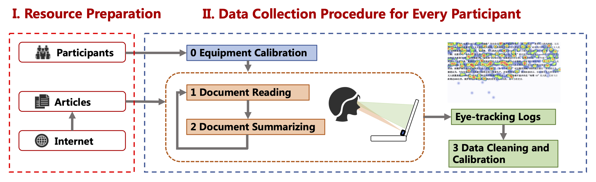
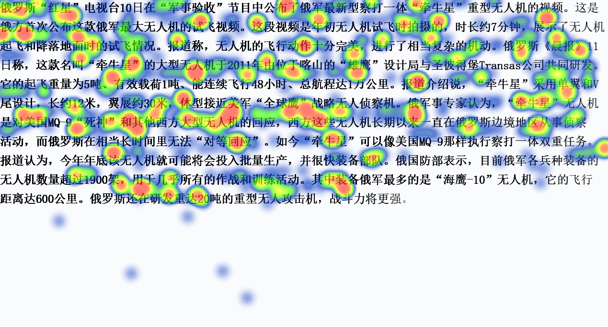

# ADEGBTS
**A** **D**ataset for **E**xploring **G**aze **B**ehaviors in **T**ext **S**ummarization.

## Motivation

Automatic text summarization has been a hot research topic for years. Though most of the existing studies only use the content itself to generate the summaries, researchers believe that an individual's *reading behaviors* have much to do with the summaries s/he generates, usually regarded as the ground truth. However, such research is limited by the lack of a dataset that provides the connection between people's reading behaviors and the summaries provided by them. 

So we provide a dataset covering 50 individuals' gaze behaviors collected by a high-accurate eye tracking device (that generates 100 gaze points per second) when they are reading 100 articles (from 10 popular categories) and composing the corresponding summaries for each article. Collected in a controlled environment, our dataset with 157 million gaze points in total, provides not only the basic gaze behaviors when different people read an article and compose its corresponding summary, but also the connections between different behavior patterns and the summaries they will provide. We believe such a dataset will be valuable for a wide range of studies.

# Dataset Collection Procedure

## Resource Preparation
We manually collected a total of $100$ samples in $10$ categories from the public news websites (**[Netease News](https://news.163.com/) and [Tencent News](https://news.qq.com/)**) for gaze collection. And Each sample includes an article and a title, where the title is used as a reference when the user writes the summary.

We used three eye tracker devices ([**Tobii EyeTracking 4C**](https://gaming.tobii.com/)) to capture the gaze behavior of participants when they were reading articles. People usually use it in PC gaming for an enhanced streaming, gameplay and esports experience. We used an [open-source program](https://github.com/oaugereau/TobiiDev) to obtain the original acquisition data from the eye tracker. And the data sampling frequency is about $100$Hz.

## Data Collection Procedure for Every Participant

1. **Equipment Calibration**:
    Before starting to read articles, every participant needs to complete the calibration of the device according to the instructions of the eye tracker. For each participant, this step only needs to be performed once before the experiment begins.

2. **Document Reading**: 
   After the device calibration is completed, the participant enters the article reading stage. At this stage, participants are required to read the entire article as continuously as possible, with no restrictions on how long they read. We have written a webpage program to display articles. By adjusting the font size and the spacing between Chinese characters, the gaze data returned by the eye tracker can be accurate to the level of words. In addition, when displaying the content of the article, we put all the Chinese characters of the same word on the same line. This avoids the jump in reading sight caused by a word appearing in two lines.

3. **Document Summarizing**: 
   After reading the article, the participant is asked to give a summary that s/he thinks fits the content of the current article. The participant can use words that do not appear in the original text to compose the final summary. At this stage, the original title of the article is presented as a reference at the bottom of the screen. The reason for providing a reference summary is to prevent the summary given by the participant from being too ad-hoc. 

4. **Data Cleaning and Calibration**:  
   After the current user has read and summarized all the articles, we can get eye-tracking logs of the entire reading process through the background program. First, we used timestamps recorded by the webpage program to obtain the log corresponding to each article. In actual experiments, it is found that the eye tracker still has a certain deviation from the text near the edge of the screen, which requires us to perform data calibration based on the original data. We just need to get the coordinates returned by the eye tracker on the four corners of the reading frame and calculate the offset. And a heat map (Generated by Python package [heatmappy](https://github.com/LumenResearch/heatmappy)) of the gaze behavior on the article is shown below.
   

## Dataset Availability and Format

The dataset can also be downloaded from [Dropbox](https://www.dropbox.com/s/vf5lck49opig8cm/ADEGBTS.zip?dl=0).

